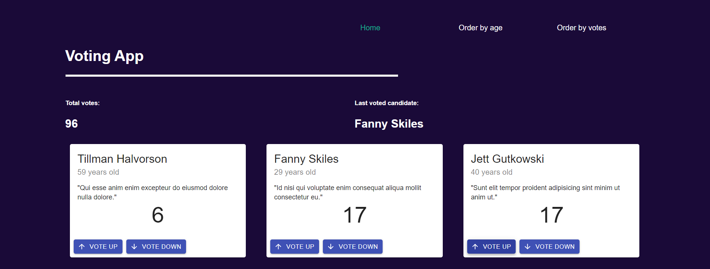

# VOTING APP - FRONTEND TF

This is a simple project developing using create-react-app and Typescript. 

This app shows 20 candidates created by Backend project randomly. You can watch different attributes of them like: full name, age, slogan and number of votes. At Home page you can see the number of total votes, voting for someone up or down and look the last candidate you voted. At Order by Age page you can order candidates descencing or ascending depending on age. At Order by Votes page you can order candidates by number of votes. Each candidate is an adult and has upper or equal to 0 votes and lower or equal to 20 votes.

Connection with backend is through Graphql. If you want to take a glimpse to this project, [visit it here.](https://github.com/luisVidal97/backend-voting-app).

## Starting 🚀

If you you want to run the project locally, please clone this repository in one of your personal folders.

```
git clone https://github.com/luisVidal97/frontend-voting-app.git
```

And then, in the project root run the following to install all required dependences:

```
npm install
```

With the above, you could enjoy the project, explore different functionalities and do whatever you want.

## Developing with 🛠️

- [React with Functional Components](https://es.reactjs.org/)
- [TypeScript](https://www.typescriptlang.org/) 
- [Material UI](https://material-ui.com/es/getting-started/installation/)
- [Apollo client](https://www.apollographql.com/docs/tutorial/introduction/)

## Authors ✒️

- **Luis Fernando Cruces** - luisfcv97@gmail.com

If you have any recomendation or something to contribute, please let me know sending a message! I will be very eager to receive it.
